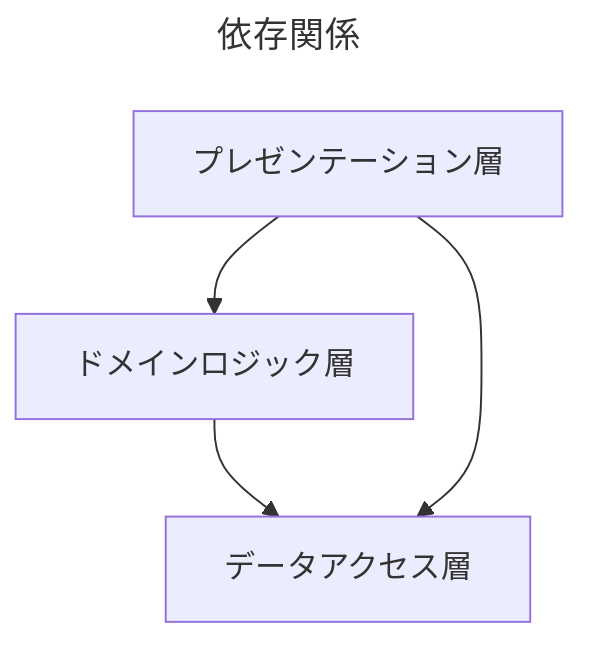
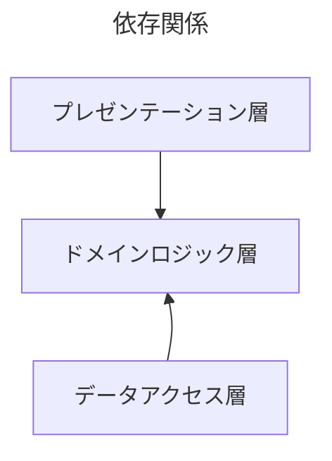

Javaで書いた『DIの原理・原則とパターン』サンプルプログラム
====

書籍『DIの原理・原則とパターン』ISBN978-4-8399-8306-2 のサンプルプログラム[https://github.com/DependencyInjection-2nd-edition/codesamples](https://github.com/DependencyInjection-2nd-edition/codesamples)はC#で書かれているが、理解のためにJavaで書き直してみる。

特定のフレームワークに依存するのを避けたが、WebアプリケーションではApache Wicketを使用している。

https://wicket.apache.org

# 動作条件

- JDK 17 以上 (Apache Wicketによる制約)
- Apache Maven 3

# 第1章 依存注入(Dependency Injection)の役割

```shell
cd chap01
mvn exec:java
```

# 第2章 密結合したコードで構築されたアプリケーション

```shell
cd chap02
mvn jetty:run
```

※ 停止は```Ctrl-C```

|ID | パスワード | ロール|
----|------------|--------
|user|password|なし|
|premier|password|preferredCustomer|

## 密結合の依存関係



- プレゼンテーション層はドメインロジック層とデータアクセス層に依存している❌
- ドメインロジック層はデータアクセス層に依存している❌
- データアクセス層はどこにも依存していない

# 第3章 疎結合なコードへの変換

```shell
cd chap03
mvn jetty:run
```

※ 停止は```Ctrl-C```

## 疎結合の依存関係



- プレゼンテーション層とデータアクセス層はドメインロジック層に依存している👍
- **ドメインロジック層はどこにも依存していない**👍

依存関係逆転の法則 (Dependency Inversion Principal) に則っている。

# 第4章 依存注入のパターン
```shell
cd chap04
mvn jetty:run
```

※ 停止は```Ctrl-C```

